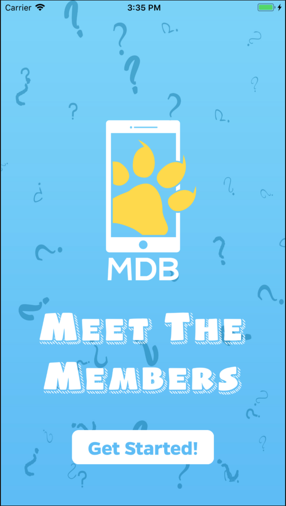
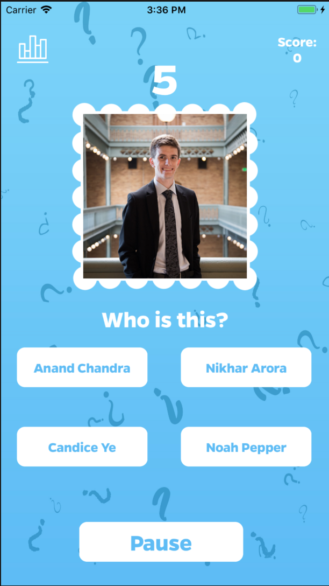
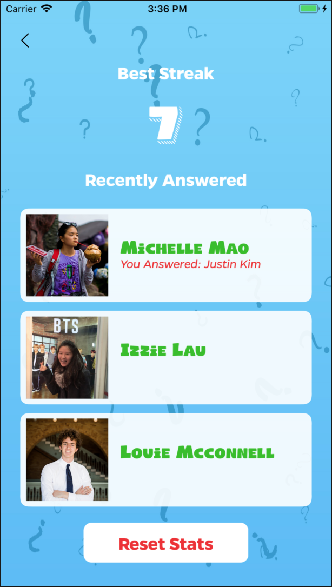

# Meet The Members - MDB

## Description
This is my first iOS application. It displays the members of MDB for Fall 2018 and gives the user 5 seconds to identify a member based on a picture. The game keeps track of the last three questions proposed, the number of questions answered correctly this game, as well as the user's highest streak. Users can clear their statistics and start the app anew, or simply start a new game with a new score.

## Screenshots
Welcome to Meet the Members.
 

Identify members of MBD.
 

Track statistics!
 

## Acknowledgements
* Adapted Queue Data Structure [\(Swift Algorithm Club\)](https://github.com/raywenderlich/swift-algorithm-club/blob/master/Queue/)
* MDB iOS Instructors/Mentors Max Miranda, Will Oakley, Shubham Gupta

